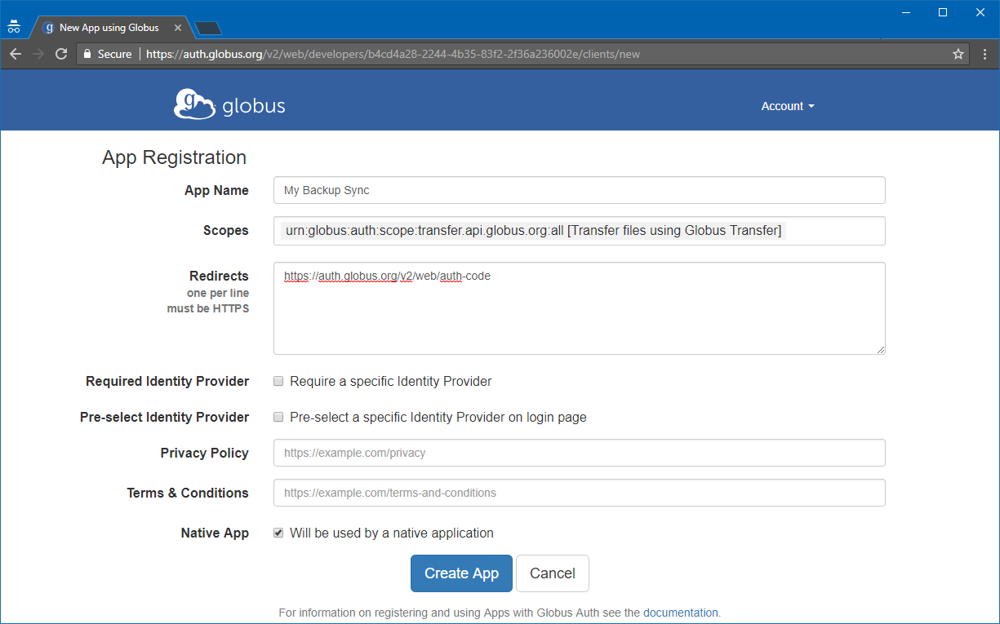

# Globus Sync

This repository contains a Python script that uses the Globus Auth and Transfer
APIs to create a transfer task. It also contains an example shell script and
crontab useful for creating scheduled backups via Globus.

# How To Use This Script

1. **Clone this repository** to wherever you will be using it:

		$ git clone https://github.com/nuitrcs/globus-sync-example.git
		$ cd globus-sync-example

2. **Create an app in Globus.** Visit
   [https://auth.globus.org/v2/web/developers](https://auth.globus.org/v2/web/developers)
   and authenticate. Then create a project if you don't already have one. Then
   click the "Add..." button and choose "Add new app". Enter the following
   data:

     - App Name: Can be any name you want
	 - Scopes: Must include `urn:globus:auth:scope:transfer.api.globus.org:all`
	 - Redirects: Must include `https://auth.globus.org/v2/web/auth-code`
	 - Pre-select Identity Provider: (Optional) If desired, check this box and choose your
	   institution (e.g. Northwestern University). This will save you a step
	   later when you authenticate.
	 - Native App: This checkbox *must* be checked.

   

3. **Copy Client ID from Globus into `run_globus_sync.sh`.** After the app is
   created, the Client ID will be shown. Copy this Client ID and edit
   `run_globus_sync.sh`, replacing the string `<PASTE YOUR CLIENT ID HERE>`
   with the Client ID.

4. **Get the endpoint UUIDs for the source and destination endpoints.** In the
   [Globus Transfer console](https://www.globus.org/app/transfer), click on
   [Endpoints](https://www.globus.org/app/endpoints), search for an endpoint
   you wish to use, click the "show detail" button on the right, then find the
   UUID and click the "copy" button to copy it to the clipboard.

   

5. **Update `run_globus_sync.sh` with the source and destination endpoint IDs and
   paths.** Edit `run_globus_sync.sh` and edit the source endpoint, source
   path, destination endpoint, and destination path with the appropriate
   values. (Note the `<>` characters are markers for what should be replaced,
   make sure not to leave them in the file. IE the destination path should look like
   `/~/myfolder`, not `</~/myfolder>`.)

6. **Execute `run_globus_sync.sh`** and authenticate via the given URL, pasting the
   Native App Authorization Code into the terminal.

		$ ./run_globus_sync.sh
		Native App Authorization URL:
		https://auth.globus.org/v2/oauth2/authorize?client_id=xxxxxxxxxxxxxxxxxxxxxxxxxxxxxxxxxxxx&redirect_uri=https%3A%2F%2Fauth.globus.org%2Fv2%2Fweb%2Fauth-code&scope=urn%3Aglobus%3Aauth%3Ascope%3Atransfer.api.globus.org%3Aall&state=_default&response_type=code&code_challenge=xxxxxxxxxxxxxxxxxxxxxxxxxxxxxxxxxxxxxxxxxxx&code_challenge_method=S256&access_type=offline
		Enter the auth code:

   You will copy the Native App Authorization URL and paste it into your
   browser's location bar. Authenticate as normal to Globus, and you will be
   redirected to a page that displays an authorization code. Copy that
   authorization code and paste it into the "Enter the auth code:" prompt.
   The script will store the resulting authentication tokens in a file called
   `.globus-sync-data.json` and they are valid for 48 hours.

   Your transfer will now run in Globus and you can check on its status via the
   URL shown in your terminal.

7. **Install the script into your crontab to run it every day.** Edit the
   example `crontab` file with your email address and the correct path to
   `run_globus_sync.sh`. If desired, change the cron expression that controls
   when the script runs (it defaults to 1:30am every day). Then, install the
   file into cron with this command:

		crontab <crontab

